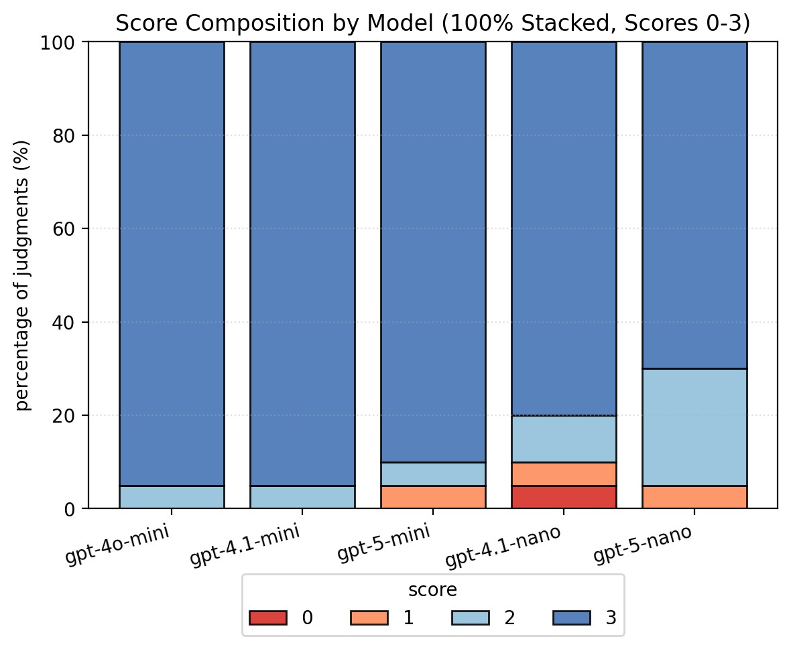

# LLM-as-a-Judge Lite

A simple and lightweight LLM-as-a-judge benchmark. Asynchronous, multi-model, and multi-question.

For illustration, this repository includes a benchmark based on Julius Caesar.

## Setup
- Python >= 3.9 and `uv` installed, If you don't have `uv`, you can install it with `pip install uv`

```bash
cp .env.example .env
```
Add your `OPENAI_API_KEY` to `.env`

```bash
uv sync
```

## How to use

1. Add your judge and player models to `config/bench.yaml`
2. Edit `data/questions.json` with your questions
3. (Optional) Modify `prompts/player.txt` and `prompts/judge.txt`.
4. (Optional) Change the rubric in `prompts/judge.txt`.

5. Run the benchmark:

```bash
uv run python run_judge.py
```

## Example Output


